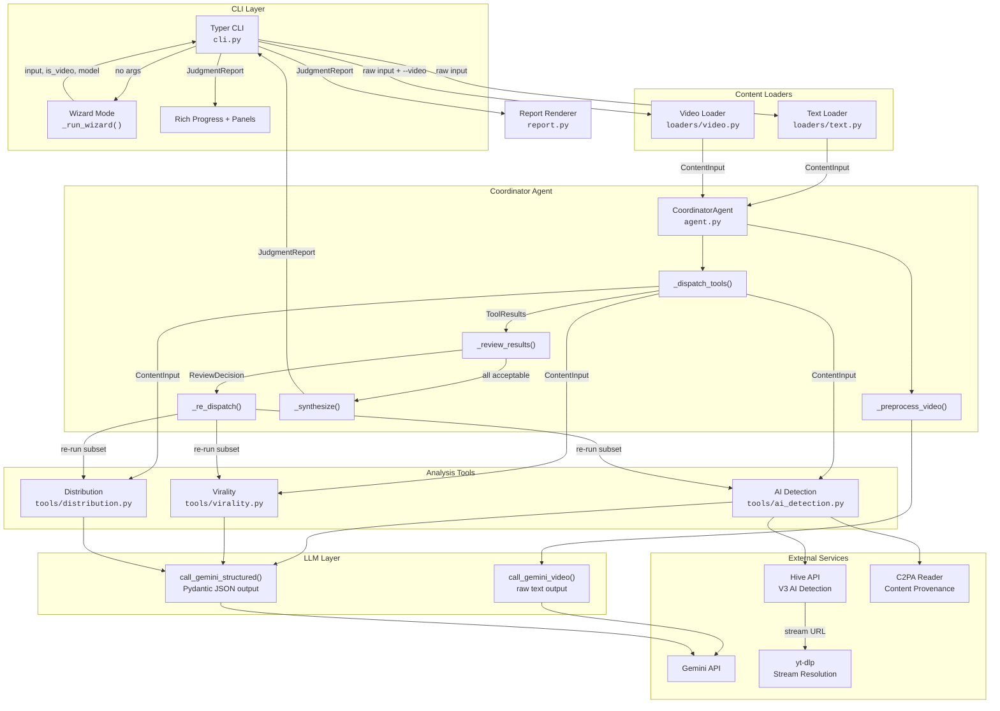
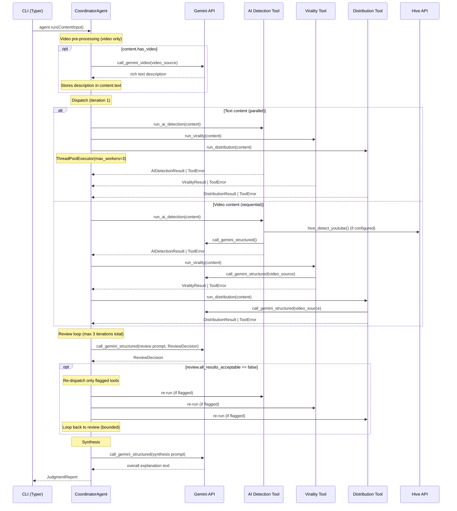

# System Architecture

## 1. System Overview

Content Judge is an AI-powered content analysis agent that evaluates text and video content across three dimensions: AI detection, virality potential, and audience distribution fit. It produces a `JudgmentReport` containing structured results from each dimension plus a synthesized overall explanation. The core architectural pattern is a **`CoordinatorAgent`** that dispatches three independent analysis tools in parallel (text) or sequentially (video), reviews their results via Gemini, re-dispatches tools that need refinement, and synthesizes a final report. Gemini is the sole LLM provider; Hive API provides optional high-accuracy video AI detection. For the reasoning behind these choices, see [Design Decisions](03-design-decisions.md).

## 2. Component Map

## 3. The Agentic Loop

The `CoordinatorAgent` implements a bounded agentic loop. After the initial dispatch, it calls Gemini with a review prompt that returns a `ReviewDecision` -- a Pydantic model containing `all_results_acceptable: bool` and `re_run_tools: list[str]`. If any tools are flagged, only those tools re-run with the same `ContentInput`. The loop is hard-capped at `MAX_ITERATIONS = 3` (defined in `agent.py` line 37). If the review call itself fails (`LLMError`), the `CoordinatorAgent` accepts results as-is via a fallback `ReviewDecision(all_results_acceptable=True)`. The synthesis step uses `COORDINATOR_SYNTHESIS_PROMPT` to produce a 3-5 sentence explanation that reconciles findings across all three tools. If synthesis fails, `_fallback_synthesis()` generates a basic concatenation of key metrics. For a deeper discussion of why the loop is bounded and what triggers re-runs, see [Design Decisions -- The Coordinator Pattern](03-design-decisions.md#2-the-coordinator-pattern).

## 4. Key Architectural Properties

- **Single LLM provider (Gemini)** -- Every LLM call routes through `call_gemini_video()` or `call_gemini_structured()` in `llm.py`. One SDK (`google-genai`), one API key, one retry/backoff strategy (`MAX_RETRIES=3`, delays of 10/30/60 seconds). Swapping LLM providers requires changes to exactly one file. See [Design Decisions -- Why a Single LLM Provider](03-design-decisions.md#1-why-a-single-llm-provider) for the reasoning.

- **Tool independence** -- Each analysis tool (`run_ai_detection`, `run_virality`, `run_distribution`) receives the same `ContentInput` and produces its own result type. No tool reads another tool's output. This enables parallel execution and makes each tool independently testable and replaceable.

- **Graceful degradation via union types** -- Every tool result slot is typed `ResultType | ToolError`. If AI detection fails but virality and distribution succeed, the system still produces a report with two out of three analyses. `JudgmentReport.has_errors()` and `error_summary()` surface failures without crashing.

- **Parallel execution for text, sequential for video** -- Text analysis uses `ThreadPoolExecutor(max_workers=3)` because text prompts are small (~1-5K tokens each). Video analysis runs sequentially because each video call consumes ~100K+ tokens, and parallel calls would blow through Gemini's tokens-per-minute quota. See [Design Decisions -- Parallel vs Sequential Execution](03-design-decisions.md#6-parallel-vs-sequential-execution) for the full tradeoff analysis.

- **Structured output via Gemini JSON mode + Pydantic** -- `call_gemini_structured()` sets `response_mime_type="application/json"` and passes the Pydantic model class as `response_schema`. Gemini returns valid JSON conforming to the schema, which is parsed via `output_schema.model_validate_json()`. This gives compile-time-like type guarantees on LLM output. See [Design Decisions -- Structured Output as Architecture](03-design-decisions.md#5-structured-output-as-architecture) for the full rationale.

- **Bounded re-dispatch loop** -- The coordinator reviews results and may re-run individual tools, but the total iteration count (initial dispatch + re-dispatches) is hard-capped at 3. This prevents infinite loops and bounds cost. Re-dispatch only re-runs flagged tools, preserving previous results for tools that passed review.

- **Callback-based progress tracking** -- `CoordinatorAgent` accepts an optional `on_tool_complete` callback. The CLI uses this to advance a Rich progress bar after each tool finishes, providing real-time feedback without coupling the agent to the UI.

For detailed breakdowns of each analysis tool, see [Deep Dives](04-deep-dives.md). For assumptions and known limitations, see [Assumptions and Tradeoffs](05-assumptions-and-tradeoffs.md).

## 5. Module Responsibility Table

| Module | Responsibility | Key Classes / Functions |
|--------|---------------|------------------------|
| `content_judge/__init__.py` | Package metadata | `__version__` |
| `content_judge/agent.py` | Coordinator agent: orchestrates tool dispatch, review loop, synthesis | `CoordinatorAgent`, `CoordinatorAgent.run()`, `_dispatch_tools()`, `_review_results()`, `_re_dispatch()`, `_synthesize()`, `_preprocess_video()` |
| `content_judge/models.py` | All Pydantic v2 data models -- interface contracts between components | `ContentInput`, `AIDetectionResult`, `ViralityResult`, `DistributionResult`, `ToolError`, `ToolResults`, `ReviewDecision`, `JudgmentReport`, `AnalysisMetadata`, `TextSignalScores`, `VideoSignalScores`, `C2PASignal`, `DetectionSignal`, `ViralityDimension`, `ViralityLLMOutput`, `AudienceSegment` |
| `content_judge/cli.py` | CLI entry point: argument parsing, wizard mode, progress display, report rendering | `judge()`, `_load_content()`, `_run_wizard()`, `_detect_is_video()`, `_run_with_progress()`, `_render_report()` |
| `content_judge/llm.py` | Gemini API wrappers with retry/backoff | `call_gemini_video()`, `call_gemini_structured()`, `LLMError` |
| `content_judge/config.py` | Configuration via pydantic-settings and environment variables | `Settings`, `get_settings()`, `AVAILABLE_MODELS` |
| `content_judge/prompts.py` | All system prompt constants | `AI_DETECTION_SYSTEM_PROMPT`, `AI_DETECTION_VIDEO_SUMMARY_PROMPT`, `VIRALITY_SYSTEM_PROMPT`, `DISTRIBUTION_SYSTEM_PROMPT`, `COORDINATOR_SYNTHESIS_PROMPT`, `COORDINATOR_REVIEW_PROMPT` |
| `content_judge/report.py` | Markdown report renderer | `render_markdown()` |
| `content_judge/loaders/__init__.py` | Loader package exports and `ContentLoadError` exception | `ContentLoadError`, re-exports from submodules |
| `content_judge/loaders/text.py` | Text content loading: string, file path, or URL detection and resolution | `load_text()` |
| `content_judge/loaders/video.py` | Video validation, YouTube URL parsing, yt-dlp stream resolution | `validate_video_url()`, `parse_youtube_url()`, `is_youtube_url()`, `resolve_youtube_stream_url()`, `SUPPORTED_VIDEO_FORMATS` |
| `content_judge/tools/__init__.py` | Tool package exports | Re-exports `run_ai_detection`, `run_virality`, `run_distribution` |
| `content_judge/tools/ai_detection.py` | AI detection: C2PA check, Hive API, Gemini text analysis, signal aggregation | `run_ai_detection()`, `_run_hive()`, `_run_gemini_text_analysis()`, `_check_c2pa()`, `_aggregate_signals()` |
| `content_judge/tools/virality.py` | 7-dimension virality rubric scoring via Gemini | `run_virality()` |
| `content_judge/tools/distribution.py` | 3-layer distribution/audience-fit analysis via Gemini | `run_distribution()` |
| `content_judge/tools/hive_client.py` | Hive Moderation API V3 client for video AI detection | `hive_detect_from_url()`, `hive_detect_from_file()`, `hive_detect_youtube()`, `_hive_youtube_clip_fallback()`, `_parse_hive_v3_response()` |
