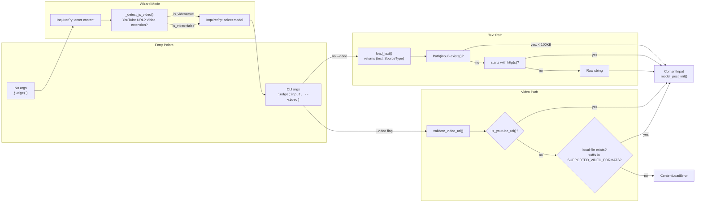
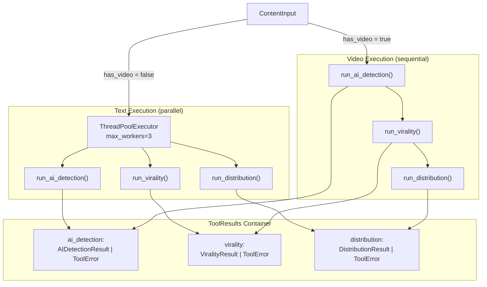
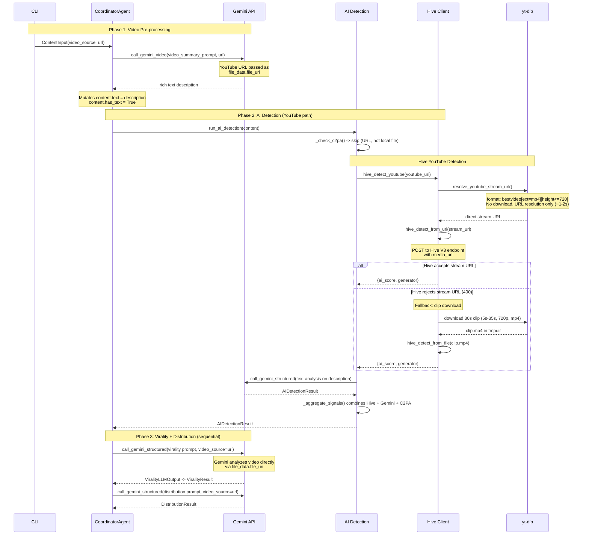
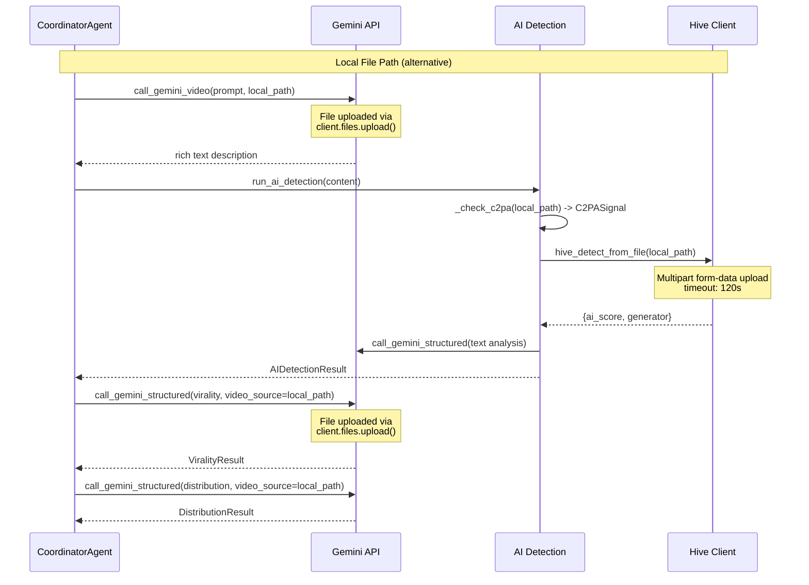
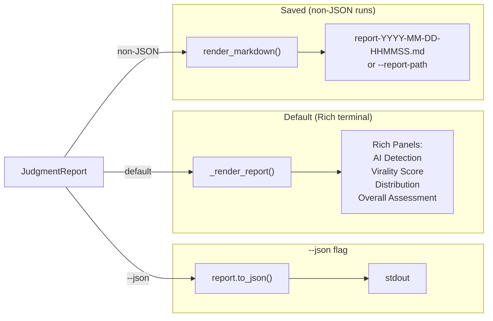

# Data Flow

## 1. Input Processing



The `_load_content()` function in `cli.py` is the routing hub. When `--video` is set (or the wizard auto-detects video), it calls `validate_video_url()` and constructs a `ContentInput` with `source_type=SourceType.VIDEO` and `video_source` set to the raw URL or file path. For text, `load_text()` tries three strategies in order: file path detection (`Path.exists()`), URL detection (`http://` or `https://` prefix), and raw string fallback. File loading is capped at 100KB; URL content is fetched via `httpx`, HTML-stripped with regex, and truncated to 50,000 characters. For how the `CoordinatorAgent` processes `ContentInput` after loading, see [Architecture -- The Agentic Loop](01-architecture.md#3-the-agentic-loop).

The wizard mode (`_run_wizard()`) runs when no positional argument is provided. It uses InquirerPy to prompt for input, then calls `_detect_is_video()` which checks for YouTube URL patterns and video file extensions (`.mp4`, `.mov`, `.avi`, `.mkv`, `.webm`, `.wmv`). The user also selects a model from `AVAILABLE_MODELS` in `config.py`. Wizard mode forces `verbose=True`.

## 2. ContentInput Model

```python
class ContentInput(BaseModel):
    # Primary fields — set by loaders
    source_type: SourceType          # STRING | FILE | URL | VIDEO
    text: str | None = None          # loaded text content
    video_source: str | None = None  # YouTube URL or local file path

    # Derived flags — computed by model_post_init
    has_text: bool = False            # True if text is non-empty after strip()
    has_video: bool = False           # True if video_source is not None
    text_length: int = 0             # len(text) or 0
    is_short_text: bool = False      # True if text_length < 200
```

`model_post_init` runs automatically after Pydantic model construction and sets all four derived flags. These flags drive branching throughout the system:

| Flag | Used By | Purpose |
|------|---------|---------|
| `has_video` | `CoordinatorAgent._preprocess_video()` | Gates video pre-processing (Gemini video description) |
| `has_video` | `CoordinatorAgent._dispatch_tools()` | Selects parallel (text) vs sequential (video) execution |
| `has_video` | `tools/ai_detection.py` | Gates Hive API call |
| `has_text` | `tools/ai_detection.py` | Gates Gemini text analysis |
| `is_short_text` | `tools/ai_detection.py` | Caps confidence at MODERATE for short text |
| `has_video` + `video_source` | `tools/virality.py`, `tools/distribution.py` | Selects video vs text prompt path |

Note: for video content, `CoordinatorAgent._preprocess_video()` mutates `ContentInput` in-place, setting `text` to a Gemini-generated video description and updating `has_text`, `text_length`, and `is_short_text`. This means after pre-processing, video `ContentInput` objects have both `has_video=True` and `has_text=True`.

## 3. Tool Execution Flow



Each tool receives the full `ContentInput` and returns its typed result or a `ToolError`. The `ToolResults` container holds all three:

```python
class ToolResults(BaseModel):
    ai_detection: AIDetectionResult | ToolError
    virality:     ViralityResult    | ToolError
    distribution: DistributionResult | ToolError
```

When a tool raises any exception during dispatch, the `CoordinatorAgent` catches it and wraps it in a `ToolError` with `is_retryable` set based on whether the error message contains "timeout" or "rate". This union-type pattern means downstream code (review, synthesis, report rendering) always handles both success and failure cases explicitly via `isinstance()` checks. See [Design Decisions -- Structured Output as Architecture](03-design-decisions.md#5-structured-output-as-architecture) for why union types were chosen over exceptions.

**Tool-specific LLM calls:**

| Tool | Gemini Call | Output Schema | Video Handling |
|------|-----------|---------------|----------------|
| AI Detection | `call_gemini_structured()` | `AIDetectionResult` | Gemini text analysis on video description; Hive API on video source directly |
| Virality | `call_gemini_structured()` | `ViralityLLMOutput` (converted to `ViralityResult`) | `video_source` passed to Gemini for direct video analysis |
| Distribution | `call_gemini_structured()` | `DistributionResult` | `video_source` passed to Gemini for direct video analysis |

## 4. Video Pipeline Detail





Key differences between the two video paths:

| Aspect | YouTube URL | Local File |
|--------|------------|------------|
| Gemini video input | `file_data.file_uri` (direct URL) | `client.files.upload()` then `Part.from_uri()` |
| Hive AI detection | `hive_detect_youtube()`: stream URL via yt-dlp, fallback to 30s clip download | `hive_detect_from_file()`: direct multipart upload |
| C2PA check | Skipped (URL, not local file) | Attempted via `c2pa.Reader.from_file()` |
| Hive fallback | yt-dlp downloads 30s clip (5-35s range, 720p, `bestvideo[ext=mp4]`) to temp dir | No fallback needed (direct upload) |

The Hive V3 response parser (`_parse_hive_v3_response()`) aggregates across per-frame results -- Hive samples at 1 FPS and returns per-frame `ai_generated` scores. The parser takes the **maximum** `ai_score` across all frames, following Hive's documentation that a video should be flagged if ANY frame scores >= 0.9. Generator attribution uses a set of 70+ known generator names (Sora, Runway, Pika, Kling, etc.) and reports the highest-scoring generator across frames. For implementation details and the reasoning behind Hive as primary signal, see [AI Detection Deep Dive](04-deep-dives.md#1-ai-detection-deep-dive) and [Design Decisions -- Right Tool for the Right Job](03-design-decisions.md#3-right-tool-for-the-right-job----hive-for-video-detection).

## 5. Output Pipeline



Three rendering paths, all driven by the same `JudgmentReport` model:

| Output | Trigger | Function | Destination |
|--------|---------|----------|-------------|
| JSON | `--json` flag | `JudgmentReport.to_json()` → `model_dump_json(indent=2)` | stdout via `typer.echo()` |
| Rich terminal | Default (no `--json`) | `_render_report(report, verbose)` | Console via Rich panels, tables, color-coded verdicts |
| Markdown file | Non-JSON runs (always in that path) | `render_markdown(report)` | File: auto-named `report-{timestamp}.md` or `--report-path` |

The JSON path is mutually exclusive with the other two -- when `--json` is set, the CLI suppresses progress display and Rich output, running the agent directly and printing JSON to stdout for piping to other tools.

The Rich terminal rendering uses color-coded output: AI detection verdict maps to a color scale (red for `ai_generated`, green for `human`), virality level maps to intensity colors, and distribution fit uses icons (`+` for strong, `~` for moderate, `-` for weak). In verbose mode (always on in wizard), additional detail panels show per-signal scores, per-dimension virality breakdowns, and analysis metadata (model used, iteration count, tool success/failure).

The markdown report is written to disk for all non-JSON runs (i.e., whenever `--json` is not set). It contains the complete analysis with tables for signals, dimension scores, and audience segments. The file is written via `Path(out).write_text(md, encoding="utf-8")`.
