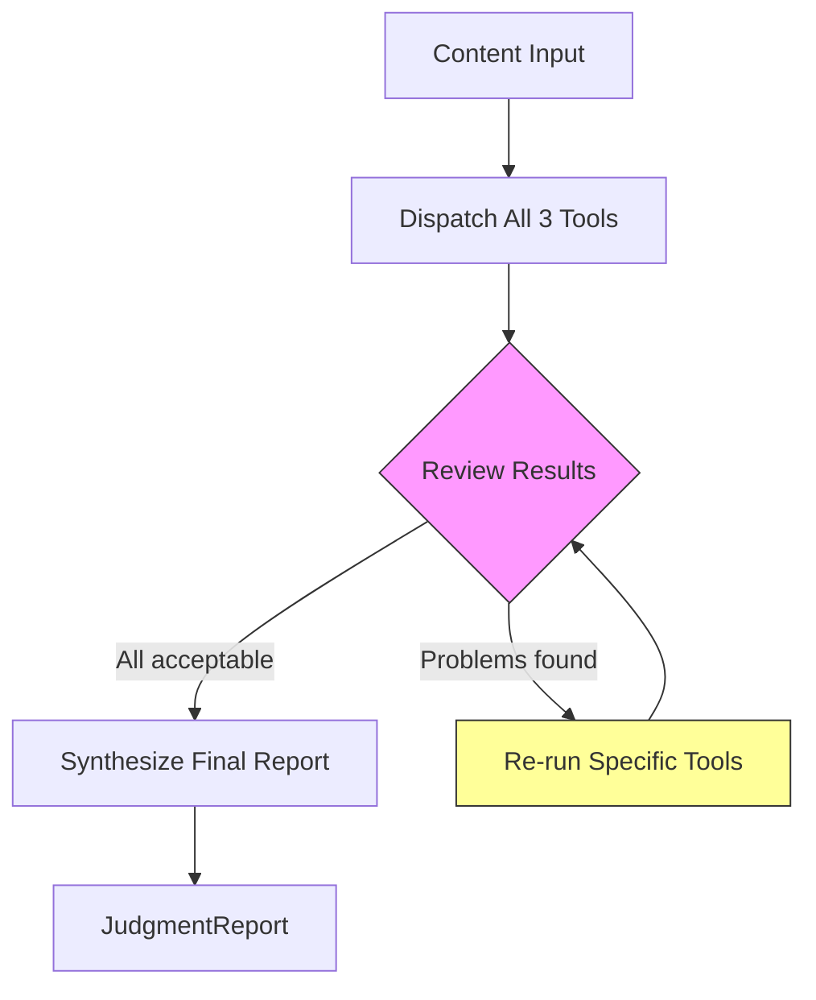
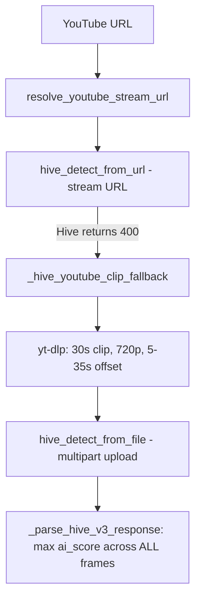
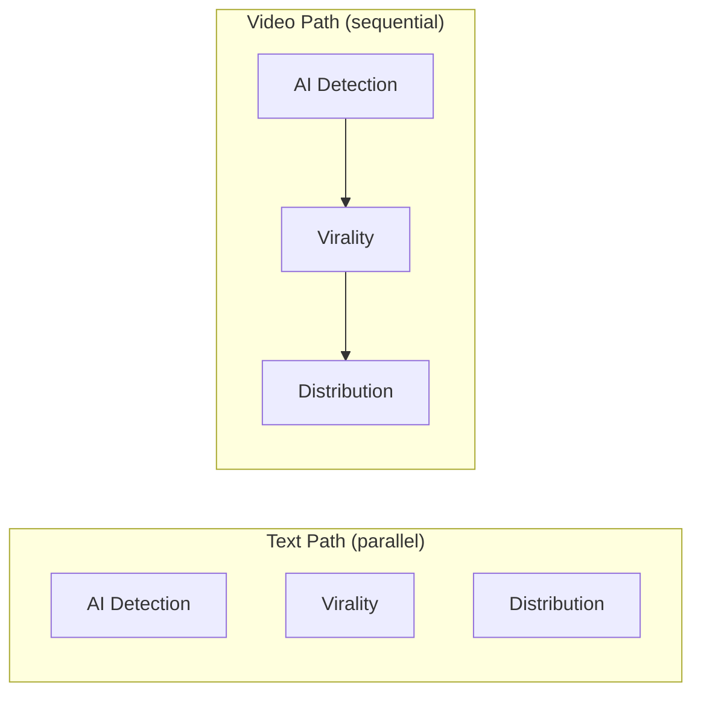

# Design Decisions

How and why the system works the way it does -- organized by theme, not chronologically. Each section explains the decision, the reasoning behind it, the alternatives that were rejected, and how the decision manifests in the actual code.

**Status:** Final | **As of:** 2026-03-05

---

## 1. Why a Single LLM Provider

**Decision:** Gemini is the sole LLM for every task in the system -- AI detection text analysis, virality scoring, distribution analysis, coordinator review, and final synthesis. There is no second LLM provider. The default model is `gemini-3.1-pro-preview`, with `gemini-2.5-pro` and `gemini-2.5-flash` available as alternatives via `AVAILABLE_MODELS` in `config.py`.

**Why Gemini specifically:** Three capabilities made it the clear choice for a content analysis agent. First, native video input: Gemini accepts YouTube URLs directly and local files via the File API, meaning the virality and distribution tools can analyze actual video content -- pacing, editing style, audio energy, production quality -- rather than working from a text description proxy. Second, structured JSON output via `response_mime_type="application/json"` combined with `response_schema`, which gives schema-level guarantees on every response (see `content_judge/llm.py`, lines 112-114). Third, cost-effective Flash pricing that keeps a multi-call agentic system affordable even on demo budgets.

**Why not multi-provider:** An earlier design used both Gemini and Claude. This meant two SDKs (`google-genai` + `anthropic`), two API keys, two retry strategies, two structured output formats to parse. For a 6-hour build, that complexity buys nothing -- Gemini handles text analysis, video analysis, structured output, and synthesis equally well through a single code path.

**What the eval harness would look like:** The single-provider decision does not close the door on evaluation. The eval concept remains valid -- it just runs Gemini Flash vs. Gemini Pro on the same content and measures inter-model agreement on scores, pairwise ranking accuracy, and reasoning quality. That is a more meaningful comparison than cross-provider noise.

**Tradeoff:** Vendor lock-in. If Gemini degrades or pricing changes, every tool is affected. For a time-boxed challenge submission, this is the right tradeoff. At scale, an abstraction layer with provider-agnostic tool interfaces would let you swap in Claude or GPT without changing business logic.

**Where it lives in code:** `content_judge/llm.py` -- two functions (`call_gemini_video` and `call_gemini_structured`) are the only LLM interface for the entire system. Every tool and the coordinator route through these.

---

## 2. The Coordinator Pattern

**Decision:** The system uses an agentic coordinator loop -- not a simple sequential pipeline -- that dispatches tools, reviews results, and can selectively re-run specific tools. The loop is bounded to 3 iterations maximum.

**Why agentic instead of sequential:** A sequential pipeline (run three tools, concatenate results, done) would be simpler but cannot respond to its own output quality. The coordinator pattern lets the system detect when results are problematic and take corrective action. This is what makes it genuinely agentic: the review step evaluates quality and makes a runtime decision about whether to accept or re-run.

**How the loop works:**

**What triggers re-runs:** Low AI detection confidence below 0.4 on content that is not trivially short; an internal contradiction between the AI detection verdict and other signals that suggests misanalysis; a transient tool error that is worth retrying (timeouts, rate limits). The `is_retryable` flag on `ToolError` drives this -- see `content_judge/agent.py`, line 146.

**What does NOT trigger re-runs:** Low scores, niche distribution results, or disagreements between tools. A piece of content that scores 2/10 on virality potential is not a failure -- it is a valid finding. The coordinator distinguishes between "this result is wrong" and "this result is unflattering."

**Why bounded to 3 iterations:** Unbounded loops create unpredictable token costs and latency. Three iterations handle the realistic failure modes (one tool returns low confidence, a transient API error, an internal contradiction). In practice, the vast majority of runs complete in one iteration. The constant lives in `agent.py` as `MAX_ITERATIONS = 3`.

**Re-dispatch is selective, not wholesale:** The `_re_dispatch` method (line 194) only re-runs the specific tools flagged by the review. If virality and distribution are fine but AI detection had low confidence, only AI detection runs again. Previous results for the other tools are preserved.

**Alternatives rejected:**
- Simple sequential pipeline: Cannot self-correct, no quality gating
- Unbounded agentic loop: Unpredictable cost, risk of infinite retries on genuinely ambiguous content
- Human-in-the-loop review: Incompatible with a CLI tool designed for automated analysis

---

## 3. Right Tool for the Right Job -- Hive for Video Detection

**Decision:** Use Hive Moderation API as the primary signal for AI-generated video detection. The LLM's role is orchestration and explanation, not detection. Hive is optional, not required -- the system degrades gracefully when it is not configured.

**The accuracy gap:** Academic research (arxiv:2506.10474) tested GPT-4o, Claude Sonnet, Gemini Flash, and Grok on AI video detection. GPT-4o achieved 67-77% accuracy (the best among VLMs). Claude scored 30-60%. Gemini scored 10-50%. Meanwhile, Hive achieves 96-99% accuracy across 100+ generators including Sora, Runway, Pika, Kling, and Flux. When a purpose-built tool gets 96-99%, layering a 30-60% LLM signal on top adds complexity without meaningful accuracy gain.

**Why Hive is optional:** Making Hive required would mean the system cannot function without an additional API key. By making it optional (configured via the `SECRET_KEY` environment variable, accessed as `settings.hive_api_token`), the system works with just a Gemini key while allowing operators who want higher video detection accuracy to configure it. When Hive is absent, the system falls back to LLM-only analysis and simply omits the Hive signal from aggregation. The free V3 tier (100 requests/day) is sufficient for demo use.

**The YouTube-to-Hive bridge:** Gemini accepts YouTube URLs directly. Hive does not. The bridge works as follows:

The stream URL path is attempted first but Hive returns HTTP 400 for YouTube stream URLs. The actual working path downloads a 30-second clip at 720p (`bestvideo[ext=mp4][height<=720]`), starting at 5 seconds to skip title cards. The parser aggregates across all frames using max `ai_score` per Hive's documented guidance and identifies the specific generator from 70+ recognized classes. This was the result of a real debugging session -- the initial implementation checked only the first frame and used `worst[ext=mp4]` quality, producing false negatives. See `content_judge/tools/hive_client.py`.

**C2PA as opportunistic signal:** C2PA content credentials are checked when the `c2pa-python` library is installed. When present and declaring AI generation, C2PA overrides to high confidence. When absent, it proves nothing -- most social platforms strip C2PA metadata during upload. The library is an optional dependency to avoid install friction from its native C++ bindings. See `content_judge/tools/ai_detection.py`, `_check_c2pa()`.

**Alternatives rejected:**
- VLM-only detection (no Hive): 30-60% accuracy is not acceptable for a detection claim
- Layering LLM on top of Hive: Adds complexity, the weak signal does not meaningfully improve the strong one
- Hive as required dependency: Raises the barrier to entry for users who just want to try the tool

---

## 4. Research-Grounded Virality Scoring

**Decision:** Score virality potential using a 7-dimension weighted rubric synthesized from Berger & Milkman (2012), the STEPPS framework, and the SUCCES framework. Each dimension has explicit 5-point BARS anchors (1/3/5/7/10). The overall score is a computed field, not LLM-supplied.

**Why a rubric instead of a single score:** Asking an LLM to "rate virality 1-10" produces arbitrary numbers. The LLM-RUBRIC framework (Microsoft Research, ACL 2024) demonstrated that multi-dimensional rubric evaluation with LLMs outperforms single holistic judgments in reliability and consistency. A rubric-based approach produces scores grounded in specific, auditable observations per dimension. It also gives the end user actionable information: "Your emotional arousal is strong but practical value is weak" is more useful than "6/10."

**The 7 dimensions and their research grounding** are detailed in [Virality Scoring Deep Dive](04-deep-dives.md#2-virality-scoring-deep-dive), including the full rubric with BARS anchors, counter-bias instructions, and the emotional quadrant classification. In brief: Emotional Arousal (20%), Practical Value (15%), Narrative Quality (15%), Social Currency (15%), Novelty/Surprise (15%), Clarity/Accessibility (10%), Discussion Potential (10%). Emotional Arousal gets the highest weight because Berger & Milkman's empirical study of all NYT articles over 3 months found it to be the single strongest predictor of sharing.

**Why "virality potential" not "virality prediction":** Even the best ML systems using real engagement data, network analysis, and temporal features achieve only ~0.71 Spearman correlation with actual sharing (arxiv:2512.21402, December 2025). That means roughly 50% of variance in sharing is explained by content features; network effects, timing, and randomness account for the rest. An LLM operating from content alone cannot exceed this ceiling. The system is honest about this: the score is labeled "Virality Potential" throughout, and the explanation field explicitly frames it as a content feature assessment.

**Why computed `overall_score` via `@computed_field`:** When LLMs supply both dimension scores and an overall score, the overall frequently diverges from the weighted average -- a known inconsistency in LLM multi-score evaluation. Computing it deterministically post-generation guarantees mathematical consistency. The LLM cannot game the aggregate by inflating it for content it "wants" to succeed. In code: `ViralityLLMOutput` (the schema sent to Gemini) excludes computed fields; `ViralityResult` (the full result) adds them. See `content_judge/models.py`, lines 156-197.

**Why dimension weights are re-applied post-LLM:** The prompt instructs the LLM to use specific weights, but `run_virality()` in `content_judge/tools/virality.py` (lines 52-54) overwrites whatever the LLM returned with the canonical `VIRALITY_DIMENSION_WEIGHTS` dict. This is a belt-and-suspenders approach: the prompt sets intent, the code enforces it.

**Why 5-anchor BARS (1/3/5/7/10) over 3-anchor:** Score clustering occurs primarily in the intermediate zones -- the LLM defaults to 5 for "okay" content and 7 for "good but not great." Five-anchor Behaviorally Anchored Rating Scales (BARS) reduce this clustering by 25%+ versus generic numeric scales by providing reference points at 3 and 7. See [Virality Scoring Deep Dive -- Prompt Engineering](04-deep-dives.md#2b-prompt-engineering) for the full anchor descriptions and `content_judge/prompts.py`, `VIRALITY_SYSTEM_PROMPT` for the implementation.

**Why timing relevance was removed:** The original planning document included "timing relevance" as a dimension. It was removed because timing requires real-time knowledge of what is culturally trending -- information a zero-shot LLM cannot reliably assess. Scoring it would produce arbitrary, unstable results. The dimension was replaced by Narrative Quality and Social Currency, both content-intrinsic features grounded in STEPPS and SUCCES.

**Counter-bias instructions:** Each dimension prompt includes an explicit counter-bias instruction to prevent the LLM from defaulting to its training biases. See [Virality Scoring Deep Dive -- The 7-Dimension Rubric](04-deep-dives.md#2a-the-7-dimension-rubric) for the full list of counter-bias directives per dimension.

---

## 5. Structured Output as Architecture

**Decision:** All LLM calls use Gemini's constrained JSON decoding with Pydantic model schemas. Temperature is 0.0 everywhere. The `JudgmentReport` Pydantic model is the single source of truth -- all output formats are renderings of one validated model.

**Schema-level guarantees:** `call_gemini_structured()` passes `response_mime_type="application/json"` and `response_schema=output_schema` to Gemini's `GenerateContentConfig`. This is constrained decoding -- the model can only generate tokens that produce valid JSON matching the schema. The result: zero parsing errors, zero missing fields, zero type mismatches. The response is validated into a Pydantic model via `output_schema.model_validate_json(response.text)`. See `content_judge/llm.py`, lines 112-114.

**Temperature=0 everywhere:** All LLM calls use `temperature=0.0` with no exceptions. This is a deliberate architectural choice, not a default. Content analysis must be deterministic and reproducible -- running the same content twice should produce the same scores. This is essential for testing (mock-based tests would fail with variance) and for user trust (scores that change on each run undermine confidence). The LLM-RUBRIC framework (ACL 2024) and LLM-as-judge best practices both recommend temperature=0 for rubric-based scoring. Analytical depth comes from rich prompts and explicit rubrics, not sampling diversity.

**The two-model pattern for virality:** `ViralityLLMOutput` is the schema sent to Gemini -- it excludes `overall_score` and `virality_level` because those are computed fields that the LLM should not generate. `ViralityResult` is the full result model with `@computed_field` properties that calculate the weighted aggregate and categorical level. The conversion happens in `run_virality()` after the LLM returns. This pattern keeps the LLM focused on dimension-level scoring while ensuring the aggregate is mathematically consistent. See [Virality Scoring Deep Dive -- Computed vs LLM-Supplied Fields](04-deep-dives.md#2c-computed-vs-llm-supplied-fields) for the full breakdown.

**Union types for graceful degradation:** `ToolResults` uses union types: `ai_detection: AIDetectionResult | ToolError`. If a tool fails, the system stores a `ToolError` with the failure reason and retryability flag instead of crashing. The `CoordinatorAgent`, synthesis step, and CLI rendering all check `isinstance(result, ToolError)` before accessing fields. This means a Hive timeout does not prevent the virality and distribution results from reaching the user. See `content_judge/models.py`, lines 248-261.

**`JudgmentReport` as single source of truth:** Every output format -- Rich terminal panels, `--json` mode, `--verbose` mode -- is a rendering of the same `JudgmentReport` Pydantic model. `--json` mode is literally `report.to_json()`. Rich rendering is isolated in `cli.py` and never touches business logic. Tests validate the data model independently of display logic. The coordinator never needs to know about terminal formatting.

---

## 6. Parallel vs Sequential Execution

**Decision:** Text analysis runs all three tools in parallel via `ThreadPoolExecutor(max_workers=3)`. Video analysis runs tools sequentially. The choice is made at dispatch time based on the content type.

**Text -- parallel execution:** For text input, each tool makes a single Gemini API call with a small token footprint (~1-2K tokens per call). Running them concurrently means total latency equals the slowest tool (~6-8 seconds), not the sum (~18-24 seconds). This is a 2-3x improvement for zero implementation complexity. The three tools are fully independent -- AI detection does not feed data into virality, virality does not feed into distribution. See `content_judge/agent.py`, `_dispatch_tools()`, lines 152-169.

**Video -- sequential execution:** For video input, each Gemini call processes the full video content, consuming 100K+ tokens per call. Running three of these simultaneously would blow through Gemini's tokens-per-minute quota on the free tier, causing rate limit failures that trigger expensive retries. Sequential execution is slower (~30-60 seconds total) but reliable. See `content_judge/agent.py`, lines 136-149.

**Why `ThreadPoolExecutor` over `async/await`:** The Google GenAI SDK's synchronous client combined with `ThreadPoolExecutor` achieves the same parallelism as `asyncio` without requiring async/await throughout the codebase. Sync code is simpler to test, simpler to debug, and has a clear upgrade path -- when async is needed, the `call_gemini_structured` wrapper is the only function that needs to change. For a 6-hour build, simplicity in the concurrency model matters.

**Latency profile:**
- Text: ~6-8 seconds (bounded by slowest tool, all run concurrently)
- Video: ~30-60 seconds (sum of sequential calls: Gemini video analysis + Hive clip download/upload + tool processing)

**Alternatives rejected:**
- Sequential for everything: Wastes 12-16 seconds on text analysis for no benefit
- Parallel for everything: Would blow Gemini rate limits on video, causing retries that are even slower
- Full async architecture: Adds complexity throughout the codebase for marginal gain over `ThreadPoolExecutor`
