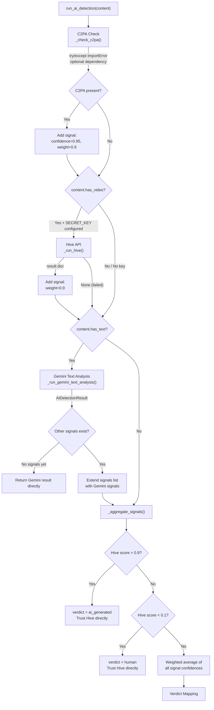

# Analysis Tools — Deep Dives

Each of the three analysis tools is independent: it receives a `ContentInput`, returns a typed Pydantic result, and knows nothing about the other tools. Tools do not share data with each other — the `CoordinatorAgent` handles cross-tool synthesis after all three complete. All three tools use Gemini structured output (`call_gemini_structured()` with `response_mime_type="application/json"`) at `temperature=0`. For the architectural context of how tools are dispatched and reviewed, see [Architecture -- The Agentic Loop](01-architecture.md#3-the-agentic-loop). For the reasoning behind structured output and temperature=0, see [Design Decisions -- Structured Output as Architecture](03-design-decisions.md#5-structured-output-as-architecture).

---

## 1. AI Detection Deep Dive

### 1a. Signal Architecture

AI detection scores content across two independent signal families, each with five dimensions scored 0.0-1.0 (higher = more AI-like).

**Text Signals** (`TextSignalScores` in `models.py`):

| Signal | What It Measures |
|--------|-----------------|
| `vocabulary_uniformity` | AI maintains a consistent vocabulary register throughout; human writing naturally mixes formal, casual, technical, and colloquial |
| `burstiness` | Human writing varies sentence length and complexity ("burstiness"); AI tends toward uniform sentence structure |
| `hedging_frequency` | AI overuses qualifiers like "it's important to note" and "it's worth mentioning" |
| `formulaic_patterns` | AI follows predictable structures (intro-body-conclusion, numbered lists, "In conclusion") |
| `tonal_uniformity` | AI maintains an even, measured tone; human writing shifts between enthusiasm, frustration, humor, tangents |

**Video Signals** (`VideoSignalScores` in `models.py`):

| Signal | What It Measures |
|--------|-----------------|
| `temporal_consistency` | AI video has objects that morph, flicker, or change between frames |
| `physics_plausibility` | AI video may show impossible physics — objects floating, gravity defied, unnatural liquid behavior |
| `texture_artifacts` | AI content has waxy skin, blurry edge details, repeating texture patterns |
| `lighting_consistency` | AI may have inconsistent shadow directions, impossible light sources, flat lighting |
| `composition_naturalness` | AI compositions feel "too perfect" — overly symmetrical, too-clean framing, lacking natural randomness |

**Why these specific signals:** The multi-trait approach is grounded in EMNLP 2025 survey findings and Chiang & Lee 2023, which demonstrate that multi-trait chain-of-thought scoring outperforms single-verdict prompts for AI detection. Each signal captures a distinct linguistic or visual dimension, and the system scores them independently rather than asking for a single "is this AI?" answer.

**Why signal independence matters:** Mixed evidence is informative. A piece of content with high `vocabulary_uniformity` but low `tonal_uniformity` tells a meaningfully different story than one where all signals point the same direction. An AI-assisted draft that a human edited for tone would show exactly this pattern — the vocabulary remains uniformly polished but the emotional register becomes naturally varied. Independent signals preserve this diagnostic information rather than collapsing it into a single score prematurely.

### 1b. Multi-Source Aggregation

The `_aggregate_signals()` function in `ai_detection.py` implements a priority chain that combines up to three signal sources — C2PA metadata, Hive API scores, and Gemini text analysis — into a single `AIDetectionResult`.

**Verdict mapping** from weighted average confidence:

| Confidence Range | Verdict |
|-----------------|---------|
| > 0.7 | `ai_generated` |
| > 0.55 and <= 0.7 | `likely_ai_generated` |
| > 0.45 and <= 0.55 | `uncertain` |
| > 0.3 and <= 0.45 | `likely_human` |
| <= 0.3 | `human` |

The weighted average is computed as `sum(signal.confidence * signal.weight) / sum(signal.weight)` across all accumulated `DetectionSignal` objects. When Hive returns a high-confidence result (>0.9 or <0.1), the system bypasses the weighted average entirely and trusts Hive's verdict directly, reflecting Hive's documented 96-99% accuracy on AI-generated video detection.

### 1c. Confidence Calibration

The system applies conservative confidence capping via `_confidence_to_level()` and `_level_order()`, implementing asymmetric harm weighting: false positives (labeling human content as AI) cause more harm than false negatives (missing AI content), because a false positive can damage a creator's reputation.

**Code-level capping rules** (applied in `_aggregate_signals()`, lines 219-224):

| Condition | `ConfidenceLevel` | Rationale |
|-----------|--------------------------|-----------|
| `content.is_short_text` (< 200 chars) | Capped at `MODERATE` | Insufficient signal density for reliable detection |
| Text-only (`not content.has_video`) | Capped at `HIGH` | Single-source analysis cannot reach highest confidence |
| Has video | Computed from weighted average (no cap) | Multiple signal sources may support `VERY_HIGH` |

The prompt (`AI_DETECTION_SYSTEM_PROMPT`) also instructs the LLM to: allow `VERY_HIGH` when multiple sources corroborate, and set `LOW` with explanation when signals contradict. These are prompt-level guidelines that influence the Gemini text analysis result, not code-enforced caps in `_aggregate_signals()`.

The `_confidence_to_level()` function maps raw confidence floats to `ConfidenceLevel` enum values: >= 0.9 maps to `VERY_HIGH`, >= 0.75 to `HIGH`, >= 0.55 to `MODERATE`, >= 0.35 to `LOW`, and below 0.35 to `VERY_LOW`. The capping logic uses `min()` with `key=_level_order` to enforce the ceiling -- for text-only content, even if the computed level would be `VERY_HIGH`, it is capped at `HIGH`.

### 1d. Hive Integration Detail

The Hive client (`hive_client.py`) interfaces with the **V3 Playground endpoint** at `https://api.thehive.ai/api/v3/hive/ai-generated-and-deepfake-content-detection`. For why Hive was chosen over VLM-only detection, see [Design Decisions -- Right Tool for the Right Job](03-design-decisions.md#3-right-tool-for-the-right-job----hive-for-video-detection).

**Per-frame analysis:** Hive samples video at 1 FPS and returns per-frame classification results. The `_parse_hive_v3_response()` function aggregates across all frames using **max-aggregation** — taking the highest `ai_generated` score from any single frame. Per Hive's documentation, a video should be flagged as AI-generated if ANY frame scores >= 0.9. This max-aggregation strategy aligns with that guidance.

**Generator recognition:** The client maintains a `generator_names` set containing 70+ known AI generators organized by category: video generators (Sora, Sora2, Runway, Pika, Kling, Luma, Hailuo, Mochi, HunyuanVideo, CogVideoS, Veo3, etc.), image generators (Flux, Stable Diffusion, Midjourney, DALL-E, Adobe Firefly, Ideogram, etc.), and other generators (GAN, LivePortrait, SadTalker, etc.). A generator is reported only if its confidence score >= 0.01 (`best_generator_score < 0.01` sets generator to `None`). The V3 response uses the `value` field for scores, with a fallback to `score` for compatibility.

**YouTube bridge flow:**

1. **Stream URL resolution** — `resolve_youtube_stream_url()` via yt-dlp extracts a direct video stream URL (no download, ~1-2 seconds)
2. **URL submission** — `hive_detect_from_url()` sends the stream URL to Hive via JSON body (`{"input": [{"media_url": stream_url}], "media_metadata": true}`, timeout 60s)
3. **Fallback on 400** — If Hive rejects the stream URL (common for authenticated/DRM URLs), the system falls back to clip download
4. **Clip download** — `_hive_youtube_clip_fallback()` downloads a 30-second clip via yt-dlp with format `bestvideo[ext=mp4][height<=720]`, time range 5-35 seconds, saved as `clip.mp4` in a temporary directory
5. **File upload** — `hive_detect_from_file()` uploads the clip via multipart form-data with a 120-second timeout

Local files bypass the YouTube bridge entirely — `hive_detect_from_file()` uploads them directly via multipart form-data.

### 1e. Honest Framing

All AI detection outputs use hedged language: "analysis suggests" rather than "this IS AI-generated." The prompt (`AI_DETECTION_SYSTEM_PROMPT`) explicitly instructs:

- *"Be honest about uncertainty. 'Uncertain' is a valid and valuable verdict."*
- *"Do NOT default to 'ai_generated' for well-written content. Quality != AI."*
- *"Frame findings as 'analysis suggests' not 'this IS AI-generated.'"*

The five verdict labels (`ai_generated`, `likely_ai_generated`, `uncertain`, `likely_human`, `human`) convey graduated confidence in the verdict direction, but the explanation text remains hedged regardless of verdict strength. This is both more ethical — false positives harm creators — and more accurate, since no detection system achieves 100% reliability. The `uncertain` verdict is treated as a first-class outcome, not a failure mode.

---

## 2. Virality Scoring Deep Dive

### 2a. The 7-Dimension Rubric

The virality scoring rubric is grounded in Berger & Milkman (2012) empirical findings, the STEPPS framework (Berger, 2013), and the SUCCES framework (Heath & Heath). Each dimension is scored 1-10 with research-derived weights that sum to 1.0. For the design reasoning behind a rubric (vs. a single score), computed fields, and why timing was removed, see [Design Decisions -- Research-Grounded Virality Scoring](03-design-decisions.md#4-research-grounded-virality-scoring).

| Dimension | ID | Weight | Research Basis | Score 1 | Score 10 |
|-----------|----|--------|---------------|---------|----------|
| Emotional Arousal | `emotional_arousal` | 0.20 | Berger & Milkman 2012 (strongest empirical predictor) | Emotionally flat, dry, purely factual | Intensely emotional — awe, outrage, deep empathy, visceral excitement |
| Practical Value | `practical_value` | 0.15 | STEPPS "Practical Value" | No practical utility whatsoever | Highly actionable, solves a real problem, "send this to someone" utility |
| Narrative Quality | `narrative_quality` | 0.15 | STEPPS "Stories" + SUCCES "Stories" | No narrative structure, purely abstract or list-like | Compelling narrative with tension, stakes, resolution, transportive quality |
| Social Currency | `social_currency` | 0.15 | STEPPS "Social Currency" | Sharing provides no status benefit | Sharing makes you look brilliant, funny, insightful, "in the know" |
| Novelty / Surprise | `novelty_surprise` | 0.15 | SUCCES "Unexpected" + Berger surprise research | Entirely predictable, states the obvious | Genuinely surprising, counterintuitive, "I had no idea" reaction |
| Clarity / Accessibility | `clarity_accessibility` | 0.10 | SUCCES "Simple" + "Concrete" | Dense, jargon-heavy, requires extensive background | Crystal clear, concrete, anyone can understand and retell |
| Discussion Potential | `discussion_potential` | 0.10 | Social contagion / information cascade literature | Closed topic, no room for disagreement | Highly debatable, invites personal stories, prompts "What do you think?" |

**Counter-bias instructions:** Each dimension in the prompt includes an explicit counter-bias directive to prevent common LLM scoring errors:

- **Emotional Arousal:** "Do NOT penalize negative emotions. Anger and anxiety predict sharing as strongly as awe."
- **Practical Value:** "Do NOT inflate scores for content that merely discusses useful topics. The content must actually PROVIDE the utility."
- **Narrative Quality:** "Short content can still have narrative quality. A single sentence can tell a story."
- **Social Currency:** "Social currency is context-dependent. Niche content can have very high social currency within its community."
- **Novelty / Surprise:** "Novelty is relative to the assumed audience."
- **Clarity / Accessibility:** "Do NOT penalize simple language. Simplicity is a feature, not a deficiency."
- **Discussion Potential:** "Discussion potential is not the same as controversy."

### 2b. Prompt Engineering

The `VIRALITY_SYSTEM_PROMPT` is structured as a layered instruction set designed to minimize common LLM scoring biases:

1. **Framing caveat** — Establishes that the system assesses "virality potential," not prediction. The prompt explicitly states: *"Content features explain roughly half the variance in sharing; network effects, timing, and randomness account for the rest."* This prevents the LLM from overclaiming predictive power.

2. **7 dimension definitions with 5-anchor BARS** — Each dimension includes behavioral anchors at scores 1, 3, 5, 7, and 10. BARS (Behaviorally Anchored Rating Scales) come from industrial-organizational psychology, where they are the gold standard for structured rating. The 5-anchor design (rather than 3-anchor at 1/5/10) was chosen because LLMs exhibit score clustering at intermediate zones — without behavioral descriptions at 3 and 7, the model defaults to these scores for "better than bad" and "better than average" content respectively. Five-anchor BARS reduce this clustering by 25%+ based on I/O psychology research on rater calibration.

3. **Counter-bias instructions per dimension** — Each dimension ends with an explicit instruction to counteract a known LLM tendency (e.g., penalizing negative emotions, inflating scores for topical relevance without actual utility).

4. **Emotional quadrant classification** — After scoring, the LLM classifies the dominant emotional tone using a valence-arousal model with four quadrants: `high_arousal_positive` (awe, excitement), `high_arousal_negative` (anger, anxiety), `low_arousal_positive` (contentment, warmth), `low_arousal_negative` (sadness, boredom). This classification is independent of the dimension scores and provides a complementary signal about the content's emotional character.

5. **Output schema instructions** — Specifies the exact `dimension_id` values, field names, and constraints (1-2 sentence reasoning per dimension, 1-5 primary emotions, 1-3 strengths/weaknesses).

### 2c. Computed vs LLM-Supplied Fields

The virality system uses a deliberate split between what Gemini returns and what the application uses:

**`ViralityLLMOutput`** (sent to Gemini as `output_schema`):
- `dimensions`: list of 7 `ViralityDimension` objects (dimension_id, name, score, weight, reasoning)
- `emotional_quadrant`: one of four quadrants
- `primary_emotions`: 1-5 specific emotions
- `key_strengths`: 1-3 virality strengths
- `key_weaknesses`: 1-3 virality weaknesses
- `explanation`: 2-3 sentence summary

This schema deliberately excludes `overall_score` and `virality_level`.

**`ViralityResult`** (what the system uses downstream):
- All fields from `ViralityLLMOutput`, plus:
- `overall_score`: a `@computed_field` property that calculates `sum(d.score * d.weight for d in self.dimensions)`, rounded to 2 decimal places
- `virality_level`: a `@computed_field` property that maps `overall_score` to categories: >= 7.5 is `very_high`, >= 5.5 is `high`, >= 3.5 is `moderate`, below 3.5 is `low`

**Why compute post-generation:** When LLMs supply both dimension scores AND an overall score in the same response, the overall score frequently diverges from what the weighted average of the dimensions would produce. The LLM may anchor the overall score on its "gut feeling" rather than mathematically aggregating its own dimension scores. Computing `overall_score` after generation guarantees mathematical consistency between dimension-level and aggregate scores.

**Weight re-application:** After receiving `ViralityLLMOutput` from Gemini, `run_virality()` iterates over each dimension and overwrites `dim.weight` with the canonical value from `VIRALITY_DIMENSION_WEIGHTS[dim.dimension_id]` (defined in `models.py`). This ensures that even if Gemini outputs slightly different weight values in the structured response, the system uses the research-derived weights (0.20/0.15/0.15/0.15/0.15/0.10/0.10) for all downstream computation.

### 2d. Single Code Path

`run_virality()` in `virality.py` handles both text and video content with a single function. The branching is minimal:

1. **Prompt text** — Video content gets a "VIDEO CONTENT ANALYSIS" header instructing Gemini to "Analyze this video directly for virality potential" with guidance on what to observe (topic, emotional tone, pacing, production quality, hook strength, narrative arc, shareability). Text content gets a "TEXT CONTENT TO ANALYZE" header followed by the content itself.

2. **Video source** — When `content.has_video and content.video_source` is true, `video_source` is passed to `call_gemini_structured()`, which handles URL vs. local file routing (URLs passed as `file_data.file_uri`, local files uploaded via the Gemini File API). For text-only content, `video_source` is omitted.

Everything else is shared: the same `VIRALITY_SYSTEM_PROMPT`, the same 7-dimension rubric, the same weights, and the same `ViralityLLMOutput` schema. The conversion from `ViralityLLMOutput` to `ViralityResult` (weight re-application and computed field generation) is identical for both modalities.

---

## 3. Distribution Analysis Deep Dive

### 3a. Three-Layer Framework

The distribution analysis follows a three-layer analytical sequence defined in `DISTRIBUTION_SYSTEM_PROMPT`. The order is deliberate — each layer builds on the previous one, preventing the common failure mode of jumping straight to platform recommendations without grounding them in content characteristics.

**Layer 1: Topic Classification**

Identify 1-3 categories from an 18-category IAB-adapted taxonomy:

> Technology | Business/Finance | Science/Education | Politics/Current Events | Entertainment/Pop Culture | Health/Wellness | Lifestyle/Personal Development | Sports | Arts/Creative | Food/Drink | Travel | Parenting/Family | Gaming | Fashion/Beauty | Environment/Sustainability | Humor/Comedy | Career/Professional Development | News/Journalism

Rules: maximum 3 topics, minimum 1, dominant topic first. Multiple topics only when content genuinely spans areas. The taxonomy uses 18 categories rather than the full IAB taxonomy (1,500+ categories) because granular taxonomies degrade LLM classification reliability — the model starts splitting hairs between adjacent categories. Free-form topic labels were rejected because they produce inconsistent classifications across runs (the same content might be tagged "AI Ethics," "Technology Ethics," or "Artificial Intelligence" depending on the run).

**Layer 2: Platform-Audience Mapping**

Map content to 2-5 audience segments across 9 supported platforms: **Twitter/X**, **LinkedIn**, **TikTok**, **Reddit**, **Instagram**, **YouTube**, **Newsletter/Email**, **Podcast**, **Blog/SEO**.

Each platform entry in the prompt includes platform-specific community taxonomies. For example, TikTok includes "Gen Z FYP, BookTok, FinTok, FoodTok, EduTok, MentalHealthTok, FitTok, GamingTok." Reddit is described as favoring "deep expertise without agenda, surprising statistics, research explained for non-specialists."

**Why Facebook is excluded:** Organic reach on Facebook has declined to the point where it is no longer a meaningful distribution recommendation for most content. The platform's algorithmic prioritization of paid content and groups over organic posts makes it an unreliable distribution target.

**Why Newsletter/Podcast/Blog are included:** These are owned media channels. Including them prevents the analysis from defaulting exclusively to social platforms and recognizes that long-form, expert-driven content often performs best through channels the creator controls directly.

**Layer 3: Resonance Reasoning**

For each audience segment, the prompt requires explanation using four specific signal types:

- `vocabulary_match` — What specific words or jargon in the content match this community?
- `value_alignment` — How does the content align with what this community values?
- `format_fit` — Is the content format appropriate for this platform?
- `engagement_hook` — What would trigger this community's characteristic engagement?

This layer prevents shallow recommendations. Without resonance reasoning, distribution analysis degenerates into "post it on TikTok" without justification. By requiring the LLM to articulate *why* content fits a community — using specific content signals — the analysis produces actionable recommendations grounded in actual content characteristics.

### 3b. Fit Calibration

Each audience segment receives a `FitStrength` rating (`estimated_fit` field on `AudienceSegment`):

| Fit Level | Meaning |
|-----------|---------|
| `strong` | Content naturally belongs in this community without modification. Members would feel "this is for me." |
| `moderate` | Content is relevant but requires framing or adaptation to land well. |
| `weak` | Content could reach this audience but would not resonate deeply. |

The prompt includes explicit bias checks to prevent common LLM distribution defaults:

1. *"Do not assume all tech content goes to Twitter/X and LinkedIn."*
2. *"Do not default to 'general audience' — every content has a more specific home."*
3. *"Do not recommend every platform for every content. Include weakest_reach."*
4. *"If content has strong emotional charge, that emotion determines distribution as much as topic."*

These checks counteract the LLM tendency to recommend the "obvious" platforms for a topic rather than analyzing which communities would genuinely resonate with the specific content.

### 3c. Tool Independence

Distribution analysis does NOT receive AI detection results or virality scores. Each tool analyzes content from its own lens using only the `ContentInput` object. This is an explicit architectural decision — the `CoordinatorAgent` handles cross-tool synthesis after all three tools complete. See [Architecture -- Key Architectural Properties](01-architecture.md#4-key-architectural-properties) for more on tool independence.

**Why this matters:** If the distribution tool received AI detection results, it might bias its recommendations (e.g., "this is AI-generated, so post it in AI communities"). That cross-cutting analysis belongs to the coordinator, which has visibility into all three results and can synthesize them intelligently (e.g., "this AI-generated content has high virality potential in science communities despite — or perhaps because of — its synthetic origin"). Keeping tools independent preserves the clean coordinator pattern and prevents tool coupling that would make each tool harder to test, replace, or reason about independently.

### 3d. Output Model

The `DistributionResult` model (`models.py`) captures the full output of the distribution analysis:

| Field | Type | Constraints | Purpose |
|-------|------|-------------|---------|
| `primary_topics` | `list[str]` | min 1, max 3 | Topic classifications from the 18-category taxonomy |
| `audience_segments` | `list[AudienceSegment]` | min 2, max 5 | Platform-community mappings with fit strength and reasoning, strongest first |
| `strongest_fit` | `AudienceSegment` | required | Duplicates `segments[0]` for ergonomic access — the coordinator can read `result.strongest_fit` without indexing into the list |
| `weakest_reach` | `list[str]` | min 1, max 3 | Platforms or communities where the content would NOT perform well |
| `content_format_notes` | `str` | required | Format-specific observations (e.g., "long-form text, no visuals, academic tone") |
| `distribution_strategy` | `str` | required | 3-5 sentence actionable distribution plan |
| `explanation` | `str` | required | 2-3 sentence summary of the distribution analysis |

**`weakest_reach` is required** (minimum 1 entry). This is a deliberate constraint that forces discrimination — the LLM must identify where the content would NOT work, preventing the "this content works everywhere" failure mode. Every piece of content has platforms where it would fall flat, and surfacing those platforms is as valuable as surfacing the strong fits.

Each `AudienceSegment` contains: `platform` (from the 9-value `Platform` enum), `community` (free-form string describing the specific community within that platform, e.g., "FinTwit" or "EduTok"), `estimated_fit` (the `FitStrength` enum: strong/moderate/weak), and `reasoning` (explanation of why this community fits).
